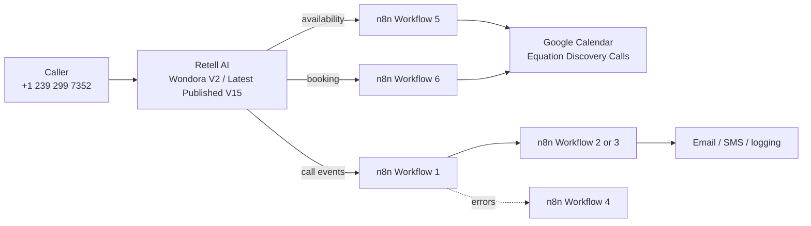

# Equation AI Receptionist

Restorable configuration and refinement history for the working Wondora production receptionist.

The immutable production capture for **The System V.1** is in [`snapshots/the-system-v1`](snapshots/the-system-v1). It records the exact live Retell, n8n, Google Sheets, and Google Calendar state observed on August 25, 2026 before the V1.1 refinement began.

## Current production architecture

Phone → Retell AI → n8n → Google Calendar → email/SMS/logging.

| Component | Production setting |
|---|---|
| Retell agent | Wondora V2 |
| Published version | V15 — Human Conversation and Scheduling Safety |
| Compliance draft | V16 — explicit post-booking SMS consent; not published |
| Phone assignment | Pinned to V16 Draft as observed August 25, 2026 |
| Phone number | +1 239 299 7352 |
| Voice | Cimo |
| Voice speed | 1.12 |
| Business timezone | America/New_York |
| Consultation duration | 30 minutes |
| Calendar | Equation Discovery Calls |

## Production workflows

1. **Main Call Router (Retell Intake)** — Receives Retell events, accepts only the final `call_analyzed` event, normalizes call data, blocks duplicate webhook deliveries, logs the call, and routes it to Workflow 2 or 3.
2. **Booking** — Performs post-call booking follow-up and logging. The prepared draft sends an SMS only after deterministic booking-success, phone, explicit-consent, call-ID, and deduplication checks. Its Google Calendar node is deactivated. It must not create calendar events.
3. **Message & Follow-Up** — Emails the business owner, sends the caller a received-message SMS, and logs non-booking outcomes.
4. **Error Handler** — Receives n8n workflow failures and emails the configured operator.
5. **Check Calendar Availability** — Checks the calendar once for the requested window. If unavailable, it returns the three nearest valid 30-minute alternatives during Monday–Friday, 9 AM–5 PM Eastern.
6. **Create Calendar Booking** — The only calendar writer. It accepts Retell's nested `body.args` request format as well as direct payloads, creates the 30-minute event, includes caller details and Eastern Time context, and returns the result to Retell.

The sanitized, importable exports are in [`n8n/workflows`](n8n/workflows). Workflow 1's exact production export still contains older embedded subworkflow-trigger groups on the same canvas. They are not connected to the live Retell webhook route; the live route calls the separate Workflow 2 and Workflow 3 exports. They are preserved for snapshot fidelity and must not be invoked as calendar writers.

## Retell tools

### `check_availability_cal`

`POST https://equation-us.app.n8n.cloud/webhook/check-availability`

Required inputs: `start_time`, `end_time`.

### `book_appointment_cal`

`POST https://equation-us.app.n8n.cloud/webhook/book-appointment`

Required inputs: `start_time`, `end_time`, `caller_name`, `caller_phone`, `caller_email`.

The published prompt requires one availability call per requested time, a single caller confirmation, and a successful booking result before verbal confirmation or `end_call`.

## Calendar ownership and duplicate protection

Workflow 6 is the sole owner of calendar creation in the live production path. Workflow 2's calendar node is deliberately deactivated because the former second writer caused duplicate bookings. The inert embedded calendar branch retained in Workflow 1's exact export must remain outside the live route.

Workflow 6 generates a deterministic Google event ID from the Retell call identity plus appointment start time. Repeating the same booking request therefore cannot create a second event.

Workflow 1 deduplicates final Retell webhook deliveries by `call_id`. The prepared Workflow 2 compliance draft adds its own call-scoped SMS-attempt claim so a duplicate event cannot cause a second SMS attempt. Consent evidence remains tied to that call and is stored through the existing Bookings logging path.

## Availability behavior

Workflow 5 searches the `Equation Discovery Calls` calendar in Eastern Time. It enforces:

- Monday through Friday
- 9:00 AM through 5:00 PM Eastern
- 30-minute appointments
- one availability request per caller-requested time
- three nearest alternatives in the same response when the requested time is unavailable

## Greeting

> Howzit, thanks for calling Wondora. I'm Isabella, how can I help you today?

Retell's platform Welcome Message speaks first. The system prompt explicitly prevents a second introduction.

## Repository map

- `n8n/workflows/` — Sanitized production workflow exports.
- `retell/agent-config.json` — Reconstructed published agent settings.
- `retell/system-prompt.md` — Branch-specific Retell handbook (V14 on the protected baseline; unpublished V15 refinement on the refinement branch).
- `retell/functions.md` — Function descriptions, schemas, and endpoints.
- `retell/webhooks.md` — Agent-level webhook configuration.
- `docs/RESTORE.md` — Rebuild and validation procedure.
- `docs/PRODUCTION-SAFETY.md` — Rules that must remain true.
- `docs/SMS-COMPLIANCE.md` — Primary Profile status, consent flow, Workflow 2 gates, A2P preparation, fees, STOP/HELP behavior, and remaining approvals.
- `n8n/tests/workflow-02-sms-gating.test.mjs` — Carrier-independent SMS eligibility and deduplication tests.

No credentials, tokens, pinned execution samples, browser data, or environment-variable values are stored here.
